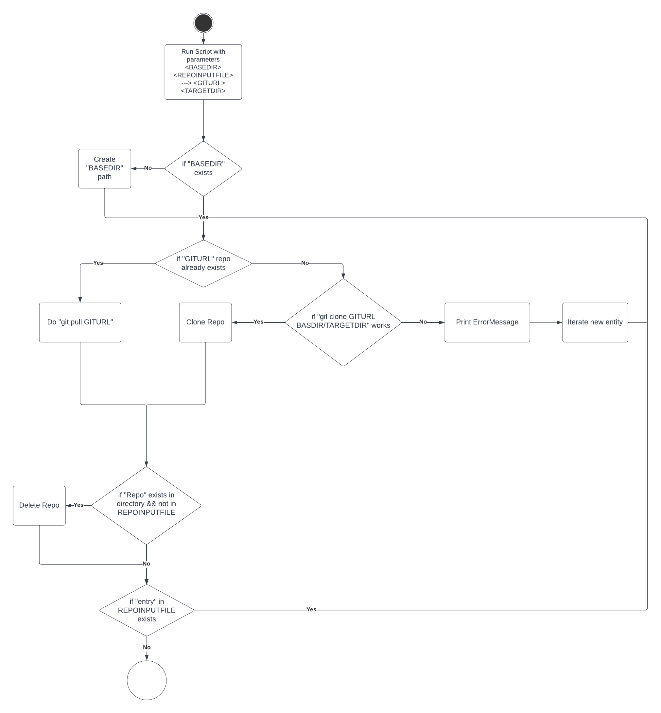

# Projekt Dokumentation

[[_TOC_]]

## Lösungsdesign
Anhand der Analyse wurde folgendes Lösungsdesign entworfen.

In der LB02 haben wir zur Aufgabe bekommen 2 Skripts zu schreiben.
Beide wurde mit Python programmiert.

#### Script 1: Git clone update repos
Das erste Skript dient dazu schnell viele Repos von einer List in einem Inputfile zu clonen.

#### Script 2: Git exract commits
Mit dem zweitem Skript sollte man können, Logs von verschiedenen Repos in einem Basedir zu nehmen und in einem File speichern, aber auch mit den Daten ein Diagram herstellen in dem man sieht wer, wann commited hat. 

### Aufruf der Skripte

TODO: schreiben sie wie die Skripte aufgerufen werden sollen (d.h. welche Parameter werden übergeben, gibt es Interaktionen mit dem Skript, läuft es automatisch täglich ab?)

Beide Skripte können mit einem -d aufgerufen werden, dieser wird zusätztliche Logs ausgeben.

#### Script 1: Git clone update repos
Für das erste Skript muss man 2 Parameter angeben.
1. BASEDIR, das Directory wo die Repos geclont werden sollen.
2. REPO_INPUT_FILE, das Inputfile mit den GIT Urls und dem Zieldirectory/Namen vom Folder wo das Repo geclont wird.

Ohne zusätztliche Logs

        ./gitrepoupdater.py BASDIR REPO_INPUT_FILE

Mit zusätliche Logs

        ./gitrepoupdaer.py -d BASDIR REPO_INPUT_FILE

Das Flag "-d" dient dazu dem Skript zu sagen, dass er alle Logs ausgeben soll.

### Ablauf der Automation

TODO: Hier kommt ihr UML-Activity Diagramm

#### Script 1: Git clone update repos

### Konfigurationsdateien

TODO: Definieren sie welche Parameter in welchen Konfigurationsdateien gespeichert werden.

#### Script 1: Git clone update repos

Für das erste Skript werden keine Configfiles gebraucht.

## Abgrenzungen zum Lösungsdesign

TODO: Nachdem das Programm verwirklicht wurde hier die unterschiede von der Implemenatino zum Lösungsdesign beschreiben (was wurde anders gemacht, was wurde nicht gemacht, was wurde zusaetzlich gemacht)

#### Script 1: Git clone update repos

Die Aufgabenstellung des Skriptes 1 ist sehr simple und alle Kriterien sollte leicht zum implementieren sein.