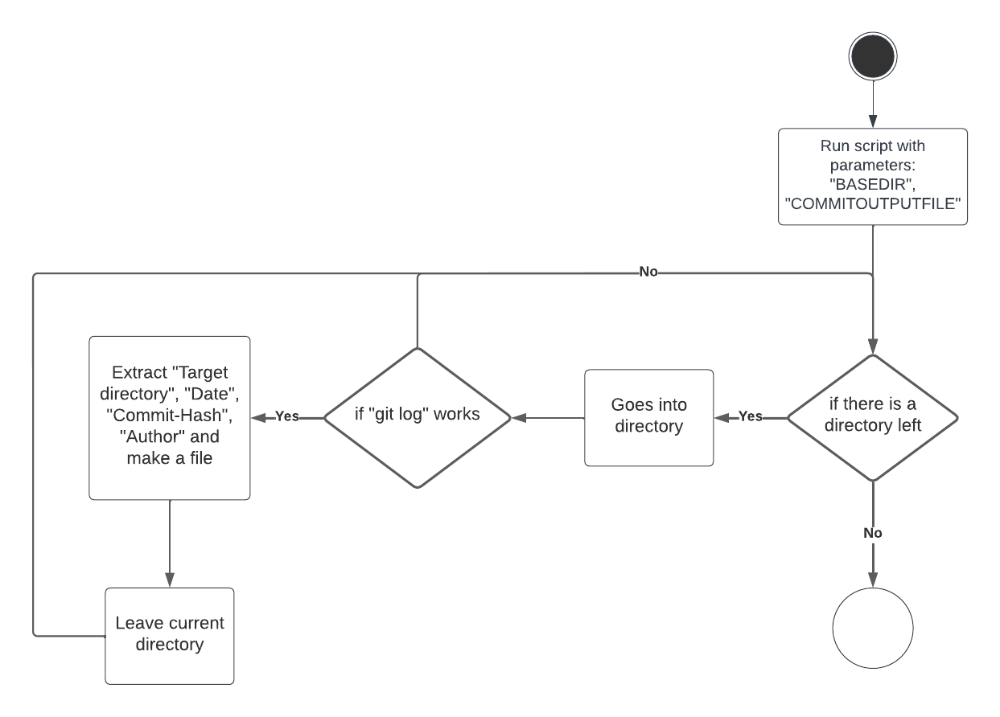

# Projekt Dokumentation

[[_TOC_]]

## Lösungsdesign
Anhand der Analyse wurde folgendes Lösungsdesign entworfen.

In der LB02 haben wir zur Aufgabe bekommen 2 Skripts zu schreiben.
Beide wurde mit Python programmiert.

#### Script 1: Git clone update repos
Das erste Skript dient dazu schnell viele Repos von einer List in einem Inputfile zu clonen.

#### Script 2: Git exract commits
Mit dem zweitem Skript sollte man können, Logs von verschiedenen Repos in einem Basedir zu nehmen und in einem File speichern, aber auch mit den Daten ein Diagram herstellen in dem man sieht wer, wann commited hat. 

### Aufruf der Skripte

TODO: schreiben sie wie die Skripte aufgerufen werden sollen (d.h. welche Parameter werden übergeben, gibt es Interaktionen mit dem Skript, läuft es automatisch täglich ab?)

Beide Skripte können mit einem -d aufgerufen werden, dieser wird zusätztliche Logs ausgeben.

#### Script 1: Git clone update repos
Für das erste Skript muss man 2 Parameter angeben.
1. BASEDIR, das Directory wo die Repos geclont werden sollen.
2. REPO_INPUT_FILE, das Inputfile mit den GIT Urls und dem Zieldirectory/Namen vom Folder wo das Repo geclont wird.

Ohne zusätztliche Logs in der Konsole

        python3 ./gitrepoupdater.py --base BASEDIR --repos REPO_INPUT_FILE

Mit zusätliche Logs in der Konsole

        python3 ./gitrepoupdaer.py --v BASEDIR REPO_INPUT_FILE

Das Flag "--v" dient dazu dem Skript zu sagen, dass er alle Logs ausgeben soll.

#### Script 2: Git exract commits
Auch für das zweite Skript muss man nur 2 Parameter mitgeben.
1. BASEDIR, das Directory wo die Repos sich befinden. -t
2. COMMITOUTPUTFILE, der Name des Outputfiles. -n

Ohne zusätztliche Logs

        ./gitextractcommits.py -t BASEDIR -n COMMITOUTPUTFILE

Mit zusätliche Logs

        ./gitextractcommits.py -t BASEDIR -n COMMITOUTPUTFILE -verbose
Wie beim Skript 1 macht das Flag "-verbose" logs auszugeben

Für den Basedir/Targetdir Pfad muss man den Flag -t verwenden, ohne dem wird das Script nicht funktionieren.

Für den COMMITOUTPUTFILE wird der Flag -n verwendet.

Falls der Nutzter ein speziellen Speicherort für die Logs will, kann der den Flag -f verwenden.

        python3 ./gitextractcommits.py -t BASEDIR -n COMMITOUTPUTFILE -l LOGSLOCATIONPATH

### Ablauf der Automation

TODO: Hier kommt ihr UML-Activity Diagramm

#### Script 1: Git clone update repos

#### Script 2: Git exract commits

### Konfigurationsdateien

TODO: Definieren sie welche Parameter in welchen Konfigurationsdateien gespeichert werden.

#### Script 1: Git clone update repos

Für das erste Skript werden keine Configfiles gebraucht.

#### Script 2: Git exract commits

Auch für das zweite Skript werden wir kein Configfile brauchen.

## Abgrenzungen zum Lösungsdesign

TODO: Nachdem das Programm verwirklicht wurde hier die unterschiede von der Implemenatino zum Lösungsdesign beschreiben (was wurde anders gemacht, was wurde nicht gemacht, was wurde zusaetzlich gemacht)

#### Script 1: Git clone update repos

Es hat sich im Grossen und Ganzen nicht viel verändert.
Es wurden einfach noch checks hinzugefügt, um zu überprüfen ob die remote-url eines bereits geklontem Repository auch mit dem des Repository.txt übereinstimmt. Falls dies nicht der Fall ist, wird das Repository gelöscht und nochmals geklont.
Züsätzlich wird das Repository.txt file auch auf Fehler überprüft z.B. bei den URLs oder beim Namen des Target-Ordners.

#### Script 2: Git exract commits

Alles was in der Aufgavenstellung des Skriptes 2 steht, kann auch ohne grössere Probleme implementiert werden.
Das einzige was das Script nicht machen kann, ist die Commits aus anderen Branches ausser main holen.
